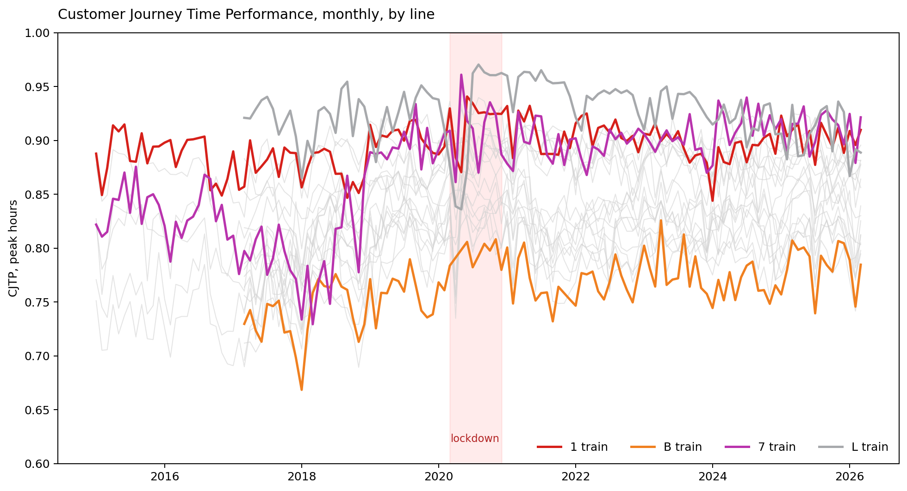
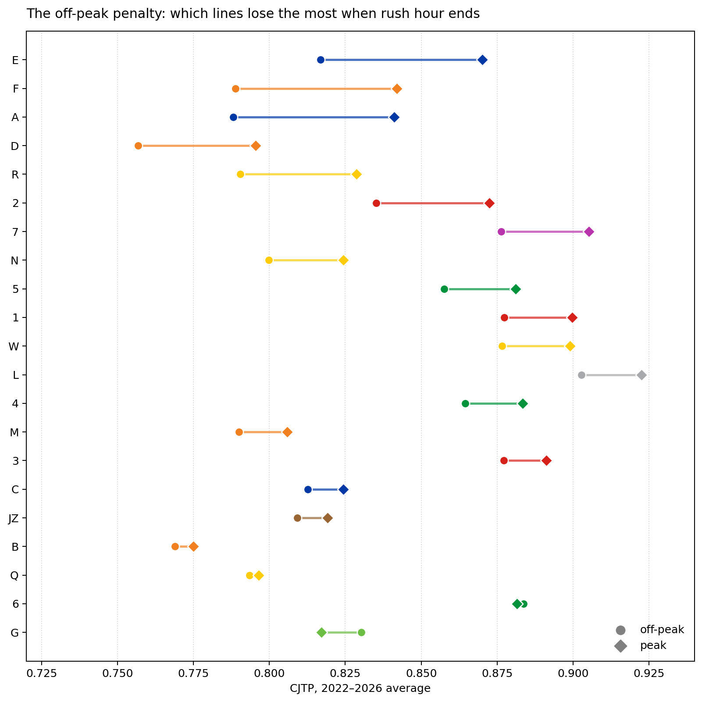
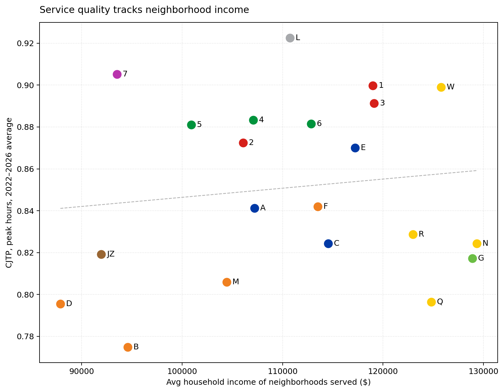
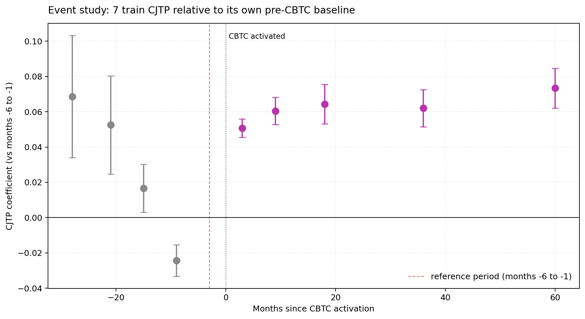

```{r setup, include=FALSE}
knitr::opts_chunk$set(
  echo = FALSE,
  message = FALSE,
  warning = FALSE,
  fig.align = "center",
  fig.pos = "H",
  out.width = "85%"
)
```

# Executive Summary {-}

<!-- TODO -->

# Background and Motivation

<!-- TODO -->

# Data and Method

<!-- TODO -->

# Findings

## Cross-line differences are systematic, not noise

Variation in subway service quality might be noise --- month-to-month fluctuation averaging out across a complex system. Eleven years of monthly Customer Journey Time Performance (CJTP) data argue otherwise. Across 21 lines over eleven years, line identity dominates: the 1 train's CJTP never falls below 0.87 in any month of the panel; the B train's never rises above 0.80. That gap is wider than any seasonal swing, any winter storm, any service-change event in the window.

The pattern is not where casual riders might place it. The 4/5 Lex express, often imagined as the system's flagship, sits in the worst tier through 2015--2017 (CJTP $\approx$ 0.73--0.77), recovering only modestly after. Outer-borough lines like the 7 and the L --- frequently characterized as overcrowded and unreliable --- are among the steadiest performers. A formal panel test confirms the visual reading. An F-test for poolability rejects the idea that the 21 lines can be treated as sharing a common service-quality level once month effects are accounted for ($F = 55.5$, $p < 0.001$).

```{r fig1, fig.cap="Customer Journey Time Performance by line and year, peak hours, 2015--2026. Each row is a subway line, each column a year; color encodes the annual mean CJTP. Off-peak service is analyzed separately in \\S3.3.", out.width="85%"}
knitr::include_graphics("../figures/01_cjtp_heatmap_wip.png")
```

The horizontal banding --- solid colors holding across columns --- shows that service quality is organized by line, not just by time.

## The pandemic shock moved the metric, not just the service

The spring 2020 lockdown did not produce a simple deterioration in measured subway service quality. Systemwide CJTP dipped in April 2020, then rebounded in May and June to levels above the immediate pre-lockdown months. This is not a recovery story. It is a denominator story.

The explanation lies in how the metric is built, not in a sudden improvement in operations. CJTP is a ratio: customer journeys completed within five minutes of schedule, divided by total customer journeys measured. When ridership collapsed and the MTA thinned the schedule in parallel, both the denominator and the operating environment changed. Trains that did run were less crowded, dwelled less at stations, and met a sparser schedule that was easier to keep. Apparent service improvement can therefore reflect the metric responding to the shock, not the system performing better for everyday riders.

The pattern was uneven across lines. The 7 train shows it most starkly: peak-period CJTP reached 0.96 in May 2020, well above its 2019 baseline near 0.89. Other lines moved less, and the L train, often discussed alongside the 7 because both run on Communications-Based Train Control, did not show the same lockdown spike. Whatever happened in April--May 2020 was not a uniform systemwide improvement; it varied sharply by line and period.

```{r fig2, fig.cap="Customer Journey Time Performance by line, January 2015 -- March 2026. The spring 2020 lockdown is shaded. Selected lines are highlighted: the 1 (red), B (orange), 7 (purple), and L (gray). The aggregate pattern shows an April 2020 dip followed by a May--June rebound; among the highlighted lines, the 7 shows the clearest May 2020 spike.", out.width="85%"}

```

The 2020 episode is a useful caution: ratio-based service metrics can move in counterintuitive directions when the underlying flows are disrupted. For that reason, the analysis that follows emphasizes line-level persistence and within-line changes rather than aggregate movement alone.

## Off-peak service quality is a frequency problem

Off-peak hours are often imagined as the subway's calmer state: fewer riders, less crowding, fewer dwell-time delays. By the CJTP measure, they are not. Across the 21 lines studied, peak-period CJTP is systematically higher than off-peak CJTP, by an average of 2 to 5 percentage points. The penalty is largest on long outer-borough lines: the F, A, and E each lose roughly 5 percentage points moving from peak to off-peak service.

The mechanism is not crowding. Off-peak trains are emptier and faster between stops. The mechanism is headway. Off-peak schedules are thinner --- trains run every 12 to 20 minutes rather than every 4 to 6 --- so a single missed train, a single signal hold, or a single dispatching delay translates into a wait long enough to push the journey past the five-minute on-time threshold. CJTP is, in this sense, sensitive to schedule density: when service is sparse, small operational frictions become large rider-experienced delays.

Two lines make the headway interpretation visible from the other direction. The G train is the clearest reversal, with off-peak CJTP about 1 percentage point higher than peak. The 6 is essentially flat, with almost no off-peak penalty. Both are short, self-contained lines that do not depend on the Manhattan trunk for connections, and both maintain relatively dense off-peak headways. When off-peak service is not thinned, the off-peak penalty disappears.

```{r fig3, fig.cap="Peak versus off-peak Customer Journey Time Performance by line, panel-period mean. Each row shows one line; the gap between the two markers is the off-peak penalty. Long outer-borough lines (F, A, E) show the largest penalties; the G train reverses the pattern and the 6 train shows essentially no penalty.", out.width="85%"}

```

The implication is that off-peak service quality is set by scheduling decisions, not by ridership demand. Lines that lose the most quality off-peak are the lines whose off-peak schedules have been thinned most aggressively. This raises a distributional question taken up in \S4: which riders rely on off-peak service, and which lines make off-peak travel costly?

## Service quality does not track neighborhood income

A standard transit-equity question asks whether subway lines that serve lower-income neighborhoods provide worse service. To test this directly, we paired each line with its transit-commuter--weighted service-area median household income. The result is a null finding. The Pearson correlation between line-level mean peak CJTP and service-area median income is 0.13. A naive OLS regression gives the same result: coefficient = 0.010 per \$10,000, $p = 0.18$. Service quality, by this measure, does not move with neighborhood income.

The geography behind the null is informative. The lowest-income service areas in the system belong to outer-borough working-class corridors: the D (\$87k), JZ (\$92k), 7 (\$93k), and B (\$95k). The highest-income areas belong to Manhattan-anchored or Brooklyn-trunk lines: the N (\$129k), W (\$126k), Q (\$125k), and R (\$123k). These two groups do not differ systematically in CJTP. Some low-income lines (the 7 in particular) outperform high-income ones; some high-income lines (the Q, R, and N during much of the panel) underperform low-income ones. The line-by-line scatter shows no organizing slope.

The most informative cases are the lines that income fails to explain. The 7 train serves a service area near \$93k yet sits in the top quartile of CJTP, with peak values around 0.91 in recent years. The L train serves a \$111k area and posts peak CJTP near 0.92. Both run on Communications-Based Train Control, a major signaling upgrade examined in \S3.5. The B and the D, by contrast, sit at the low end of CJTP regardless of how their service-area income compares with the rest of the system. Whatever explains line-level service quality, it is not income.

```{r fig4, fig.cap="Line-level mean peak Customer Journey Time Performance, 2022--2026, plotted against service-area median household income (ACS 2018--2022, weighted by commuter volume within an 800-meter walking buffer of each line's stations). The fitted line is OLS; its slope is not statistically distinguishable from zero. CBTC lines (the 7 and L) are highlighted as positive residuals.", out.width="85%"}

```

The null result does not weaken the equity question; it sharpens it. In this panel, income is not the axis along which service quality is organized. The line-level variation documented in \S3.1 is real, persistent, and consequential for riders, but it is organized by something other than the demographic composition of the surrounding tracts. \S3.5 takes up what that something might be.

## CBTC investment is associated with persistent service gains

Communications-Based Train Control (CBTC) replaces the subway\'s century-old fixed-block signaling with a system that tracks each train\'s position continuously and allows trains to operate closer together at higher reliability. The MTA has completed CBTC on two lines in the panel window: the L (operational by February 2012, before the panel begins) and the 7 (completed in November 2018). The lines that have it run differently from the lines that don\'t.

A two-way fixed-effects panel regression, with line and month effects and standard errors clustered at the line level, estimates that CJTP on a CBTC-active line is 3.0 percentage points higher than on a non-CBTC line in the same month (p = 0.017; 95\% CI: 0.6 to 5.5 percentage points). The estimate is sizable in the context of a metric whose line-level standard deviation is roughly 4 percentage points.

The event-study version of the same regression complicates the causal reading without overturning the descriptive one. Pre-period coefficients (24 to 1 month before activation) fluctuate between $+6.9$ and $-2.4$ percentage points, drifting rather than holding flat. With only the 7 train providing within-panel CBTC variation --- the L was already CBTC-active at the start of the data --- pre-trends are identified off a single line, and the parallel-trends assumption that licenses a strict causal interpretation cannot be defended here. Post-activation coefficients remain positive, generally in the $+5$ to $+7$ percentage-point range, and the treated line appears less volatile month to month.

```{r fig5, fig.cap="Event study of Customer Journey Time Performance around CBTC activation. Each point is a coefficient from a two-way fixed-effects regression with line and month effects; vertical bars show 95\\% confidence intervals from line-clustered standard errors. The L train (activated February 2012) and the 7 train (activated November 2018) are the treated lines; only the 7 provides within-panel identification.", out.width="85%"}

```

Two things follow. First, CBTC lines do not just sit at a higher CJTP level --- they sit there with an apparent reduction in month-to-month variance, which is the rider-relevant attribute that capacity-only metrics miss. Second, this analysis cannot rule out that some other line-specific change coincided with CBTC activation, particularly on the 7. With only two treated lines and one providing identification, single-line confounders (a supervisor, a fleet upgrade, a track program) are observationally indistinguishable from the signaling system itself. The descriptive claim --- CBTC lines run measurably better and more consistently than non-CBTC lines --- is well supported. The mechanistic claim --- that signaling specifically caused the gain --- requires more lines, more variation, or both. The MTA\'s planned CBTC expansion on additional corridors will provide more variation for future evaluation. Until then, the existing two-line evidence points to investment history as a more plausible equity mechanism than neighborhood income alone.

# Implications for Transit Equity Policy

<!-- TODO -->

# Limitations

<!-- TODO -->

\vfill
\noindent\textit{Replication materials, including data, code, and figures, are available at} \url{https://github.com/yidan114/please-stand-clear-of-the-closing-data}.
