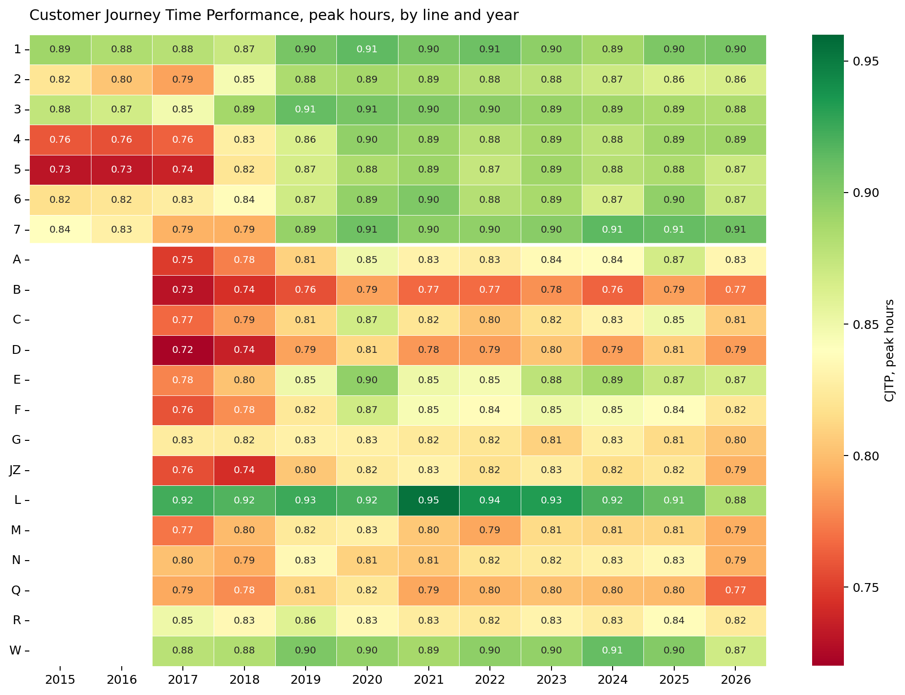

```{r setup, include=FALSE}
knitr::opts_chunk$set(
  echo = FALSE,
  message = FALSE,
  warning = FALSE,
  fig.align = "center",
  fig.pos = "H",
  out.width = "85%"
)
```

# Executive Summary {-}

<!-- TODO -->

# Background and Motivation

<!-- TODO -->

# Data and Method

<!-- TODO -->

# Findings

## Cross-line differences are systematic, not noise

Variation in subway service quality might be noise --- month-to-month fluctuation averaging out across a complex system. Eleven years of monthly Customer Journey Time Performance (CJTP) data argue otherwise. Across 21 lines over eleven years, line identity dominates: the 1 train's CJTP never falls below 0.87 in any month of the panel; the B train's never rises above 0.80. That gap is wider than any seasonal swing, any winter storm, any service-change event in the window.

The pattern is not where casual riders might place it. The 4/5 Lex express, often imagined as the system's flagship, sits in the worst tier through 2015--2017 (CJTP $\approx$ 0.73--0.77), recovering only modestly after. Outer-borough lines like the 7 and the L --- frequently characterized as overcrowded and unreliable --- are among the steadiest performers. A formal panel test confirms the visual reading. An F-test for poolability rejects the idea that the 21 lines can be treated as sharing a common service-quality level once month effects are accounted for ($F = 55.5$, $p < 0.001$).

```{r fig1, fig.cap="Customer Journey Time Performance by line and year, peak hours, 2015--2026. Each row is a subway line, each column a year; color encodes the annual mean CJTP. Off-peak service is analyzed separately in \\S3.3.", out.width="85%"}

```

The horizontal banding --- solid colors holding across columns --- shows that service quality is organized by line, not just by time.

## The pandemic dip that wasn't

<!-- TODO -->

## Off-peak service quality is a frequency problem

<!-- TODO -->

## Service quality does not track neighborhood income

<!-- TODO -->

## CBTC investment is associated with persistent service gains

<!-- TODO -->

# Implications for Transit Equity Policy

<!-- TODO -->

# Limitations

<!-- TODO -->

\vfill
\noindent\textit{Replication materials, including data, code, and figures, are available at} \url{https://github.com/yidan114/please-stand-clear-of-the-closing-data}.
